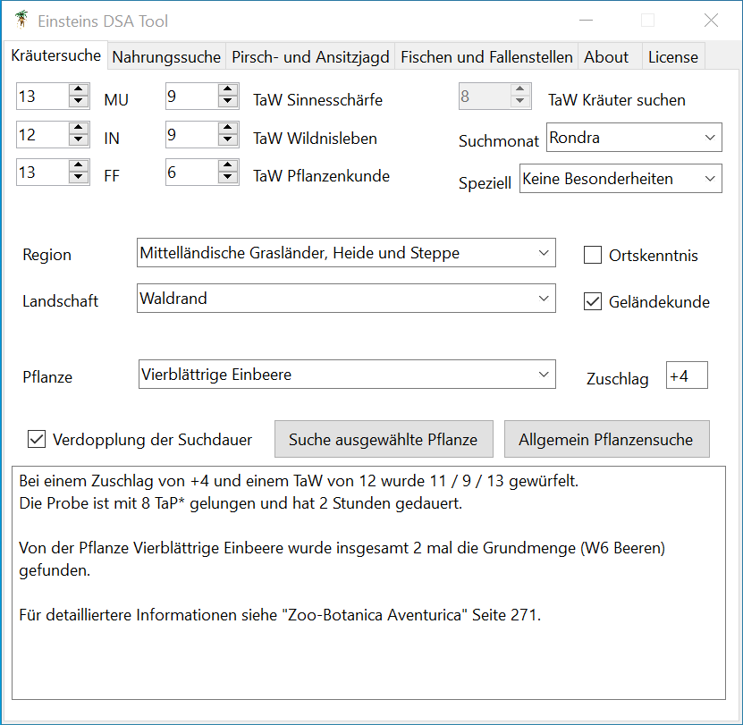

# Einsteins DSA Tool

Einsteins DSA Tool ist eine .NET 6.0 Windows Desktop Applikation (x86) und versucht die Regeln rund um die Suche nach Kräutern und die Jagd im DSA  4.1 Regelsystem einfach nutzbar zu machen.

Die Regeln lassen hier und da ein wenig Interpretationsspielraum. Beispielsweise wenn es darum geht welche Landschaften in einer konkreten Region vorhanden sind und damit letztlich welche Kräuter dort wachsen. Auch sind manche Tiere in keiner Region explizit erwähnt worden. Hier wurde jeweils versucht mit gesundem Menschenverstand und unter Berücksichtigung der Pflanzen- und Tierbeschreibungen eine spielbare Entscheidung zu treffen.

Als Quellen für wurden die folgenden Publikationen verwendet: Zoo-Botanica Aventurica, Wege des Schwertes, Wege der Alchemie, sowie Katakomben und Kavernen.

## Download

Das Tool findet sich als PayWhatYouWant zum Download im Scriptorium Aventuris. Wer möchte darf dort auch gerne eine Spende da lassen, muss aber nicht.

https://www.ulisses-ebooks.de/product/393935/Einsteins-DSA-Tool

Ansonsten findet sich hier im Repository alles um das Tool ggf. aus den Quellen selbst zu bauen. Damit sollte es auf jeden Fall für die Nachwelt erhalten bleiben. Visual Studio 2022 in der Community Edition ist die einzige Vorrausetzung.

## Screenshot

## Abhängigkeiten

Als Laufzeitumgebung wird die .NET 6.0 Desktop Runtime (x86) benötigt. Diese steht kostenfrei unter https://dotnet.microsoft.com/en-us/download/dotnet/6.0/runtime zur Verfügung.

## Geschichte

Irgendwann so um 2006 oder 2007 herum hat in unserer DSA Gruppe eine Mitspielerin eine Jägerin gespielt. Um ihre Fähigkeiten rund um die Tier- und Pflanzenkunde auch zur Geltung kommen zu lassen, und ohne dabei den Spielfluss gänzlich zum Erliegen zu bringen, habe ich begonnen dieses Tool zu schreiben. Damals hatte ich stets einen kleinen IBM X40 hinter dem Spielleiterschirm stehen.

Nach ein paar Wochen war die Version 1.0 soweit und fand regen Einsatz am Spieltisch. Wenn ich dem Zeitstempel im DSA Forum glauben schenken darf, dann muss ich so um 2010 herum angefangen haben, das Tool aktiv zu verbreiten und auf meiner Website zu hosten. Soweit ich weiß hat es seither einige Verwender gefunden. Unter anderem erfolgte 2011 eine Einbindung in die DSA Meister Geister als externes Plugin.

Bis auf das Jahr 2015 war es danach sehr lange, sehr ruhig. Damals hat mich Melanie Hüsser kontaktierte um einen Android Port umzusetzen. Damals durfte der Quellcode noch nicht öffentlich gemacht werden, daher fand ein privater Austausch statt, der ihr die ganze Arbeit des Abtippens der Regeln erspart hat. Für einige Jahre gab es, mit Zustimmung von Ulisses Spiele, DSA Hunt im Google Play Store. Leider ist die App inzwischen auch wieder verschwunden.

Erst Ende 2021 hatte ich dann wieder Zeit und Muße was zu tun und habe mich bei Ulisses Spiele darüber informiert, ob einer Veröffentlichung des Quellcodes etwas im Wege stehen würde. Die Zeiten ändern sich schließlich und mit dem Optolith steht u.a. ein DSA5 Charakter-Generator unter einer offenen Lizenz. Ich war ziemlich erfreut über ein positives Signal vom Verlag und es hat dann aber dennoch bis 2022 gedauert, ehe ich Zeit fand das Projekt anzufassen.

Die Umstellung auf .NET 6.0 war eine Art Verschmelzung von SKELETTARIUS und CHRONOKLASSIS URFOSSIL in der Zauberwerkstatt. Es war zugleich erschreckend und doch auch interessent zu sehen, wie wenig Ahnung von Datenstrukturen ich damals hatte, und wie naiv ich 2006 Software entwickelt habe. Warum ein MVVM Pattern nutzen, wenn man WinForms hat? Objektorientierung war dazu der Hype-Hammer der Zeit und folglich habe ich in jedem Problem einen Nagel gesehen, auch wenn eine Schraube genausogut funktioniert hätte. Einige der Altsünden habe ich für die aktuelle Version refaktoriert, aber wer in den Code eintaucht wird sicherlich noch so manche Programmierjugendsünde finden. Wer also Seiteneffekte im Code findet, darf sie gerne behalten.

Als kleinen Bonus habe ich für die aktuelle Version nun auch die Pflanzen aus Wege der Alchemie bzw. Katakomben und Kavernen implementiert. Die Bücher gab es damals schlicht noch nicht. Außerdem werden Einstellungen nun nachdem Schließen gespeichert und beim nächsten Start wiederhergestellt.

## Danksagung

Ich möchte mich ausdrücklich bei der Firma Ulisses Spiele dafür bedanken, dass sie einer Veröffentlichung des Quellcodes an dieser Stelle zugestimmt haben.